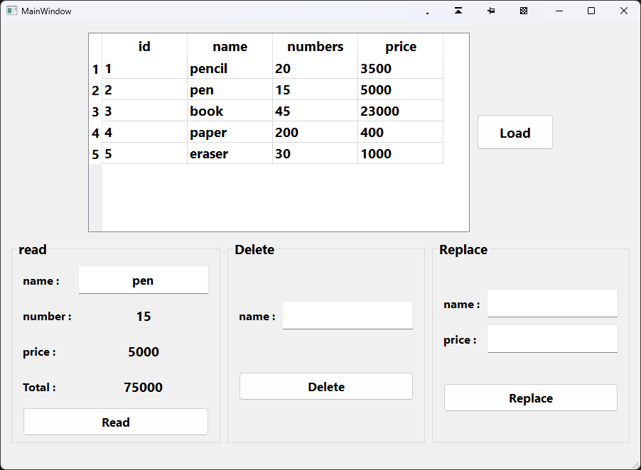

# itemPrice_(SQLite-Database)

This project is a simple example of connecting the program to the sqlite database, which shows a table containing the name of the product and the number and price of the unit, which can change the price of the product or remove it, or get the total amount.

---
 
 

